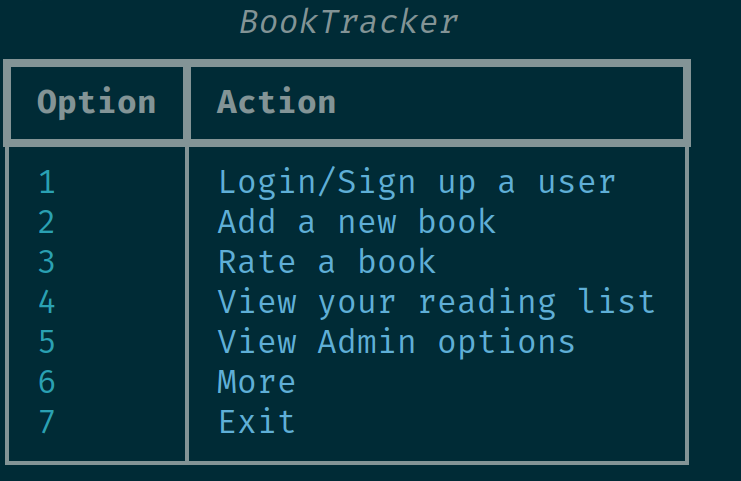
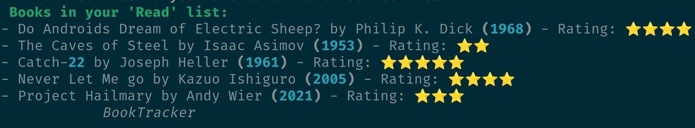
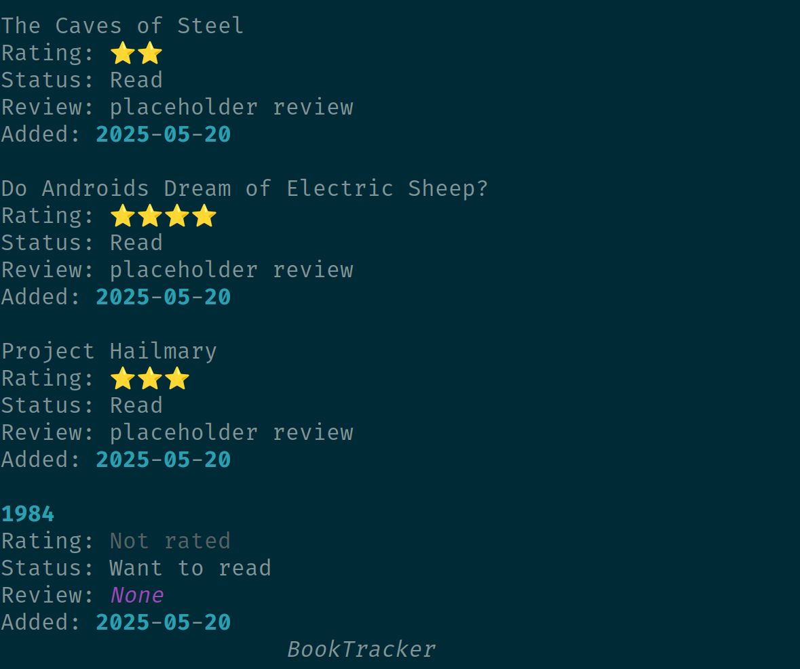

# DV1663 Database Project

This is a final project for the DV1663 course at BTH.  
The project is a console-based Python application inspired by Goodreads.  
It allows users to register, add books, rate and manage a personal reading list.

**This project was designed and tested on Ubuntu and Lubuntu.**

## Technologies Used
- Python 3
- MySQL
- DBeaver (for database management)

## Screenshots
### Main Menu



### Rated books


### Userbooks based on genre



## Dependencies

### **Manually Installed Dependencies**
These dependencies must be installed on your system before building the project:

- **Ubuntu 22.04** (Other Linux distributions may work but are untested)
- **Python3 3.12.3**
- **pip 24.o**
- **mysql 8.0.42**

### **Dependencies Handled by PIP/requriments file**
These dependencies should automatically be handled by pip using the requriments.txt
- **mysql-connector-python==9.3.0**
- **prompt_toolkit==3.0.51**
- **python-dateutil==2.9.0.post0**
- **questionary==2.1.0**
- **rich==14.0.0**

##### Installation
```
sudo apt install python3-pip
```

```
sudo apt install python3-venv
```

```
python3 -m venv venv
source venv/bin/activate
```

```
pip install -r requirements.txt
```

```
sudo apt install mysql-server
```

#### Setting up the sqldump
```
sudo mysql
```

```
CREATE USER 'appuser'@'localhost' IDENTIFIED BY 'securepassword';
GRANT ALL PRIVILEGES ON BookTracker.* TO 'appuser'@'localhost';
FLUSH PRIVILEGES;
EXIT;
```

Then in the ./sql/db.py update for the user you created 
```
mysql.connector.connect(
    host="localhost",
    user="appuser",
    password="securepassword",
    database="BookTracker"
)
```

```
(sudo) mysql < sql/schema.sql
(sudo) mysql -u root -p BookTracker < sql/RateBookProcedure.sql
(sudo) mysql -u root -p BookTracker < sql/ReturnAvgRating.sql
```
```
python3 main.py
```

In essence run schema.sql, RateBookProcedure.sql, ReturnAvgRating.sql in that order. So you can just aswell run it through dbBeaver
